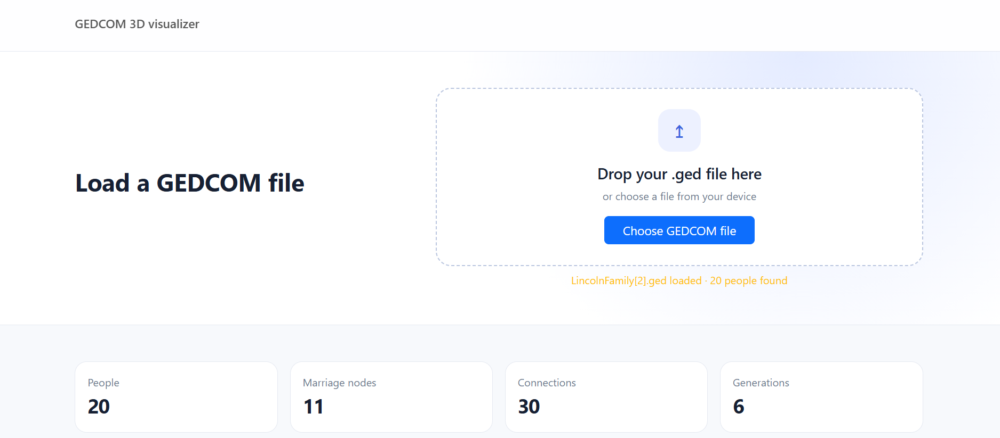
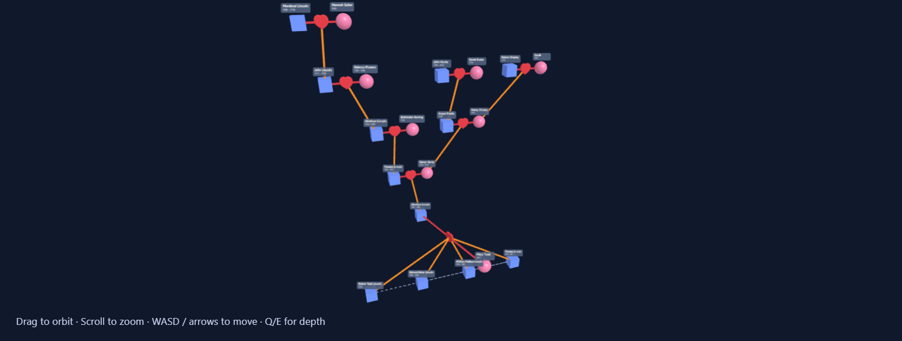
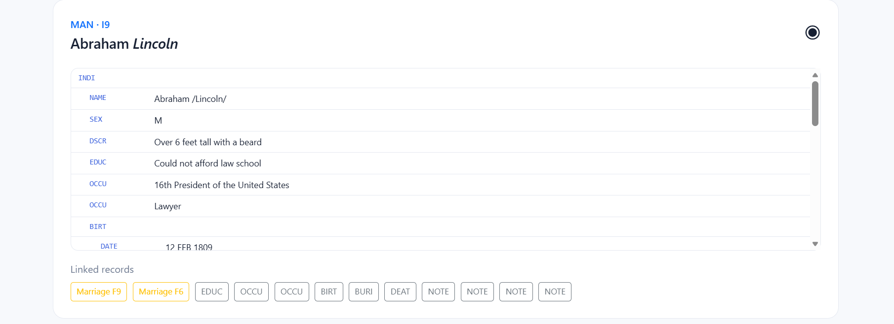
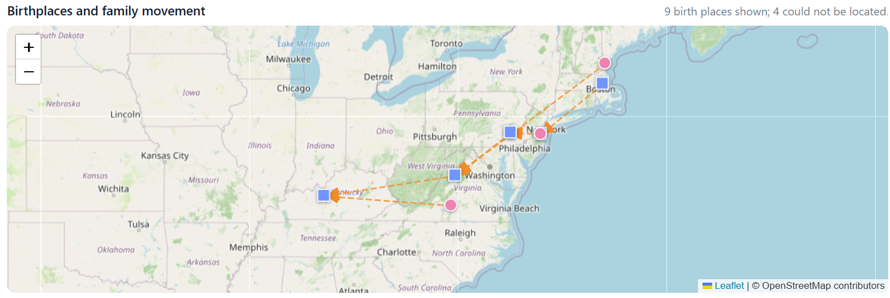

# GEDCOM 3D Visualizer

A simple HTML-based visualizer for GEDCOM family tree files. Load a `.ged` or `.gedcom` file in your browser to explore people, family relationships, and generations in an interactive 3D graph.

## Features

- [x] Load a GEDCOM file by choosing it or dragging it into the upload area.
- [x] Explore the family graph by orbiting, zooming, and moving through the scene.
  - [x] Highlight genders when avaible.
  - [x] Highlight siblinghood.
  - [ ] Display the graph always in a clean, untangled way.
  - [x] Move the camera with WASD or arrow keys.
- [x] Show basic GEDCOM details for selected people and relationships.
  - [x] Display info with dedicated modal.
  - [ ] Automatically extract common info about a record (like date of birth/death).
- [x] Support the core GEDCOM 5.5.1 records used by the visualizer.
  - [ ] FamilySearch's GEDCOM 7 support.
- [ ] Additional features
  - [x] Show movement of birthplaces with generations in a map.


## Usage

This is a static web project and does not require a build step or installation.

1. Open `index.html` in a modern web browser.
2. Choose a GEDCOM file or drag one into the upload area.
3. Interact with the generated 3D family graph.

For local development, the project can also be served with any simple HTTP server, for example:

```bash
python -m http.server 4173
```

Then open <http://127.0.0.1:4173/index.html> in your browser.

## Graph layout

The selected main person is level 0. A breadth-first traversal assigns each parent a level one step lower and each child a level one step higher, so levels represent relative generations. People at the same level are ordered along the horizontal axis;
maternal and paternal ancestry are placed on opposite depth branches to reduce crossings. Marriage nodes are placed at the arithmetic midpoint of their parents, so both marriage links meet at the same center.










## Libraries

- [THREE.js](https://threejs.org/) for the interactive 3D scene and camera controls.
- [js-gedcom](https://github.com/gedcom7code/js-gedcom) for parsing GEDCOM data.
- [Bootstrap](https://getbootstrap.com/).
- [jQuery](https://jquery.com/).
- [LeafletJS](https://leafletjs.com/) for maps.

The libraries are loaded from CDNs through the import map and stylesheet links in `index.html`.
